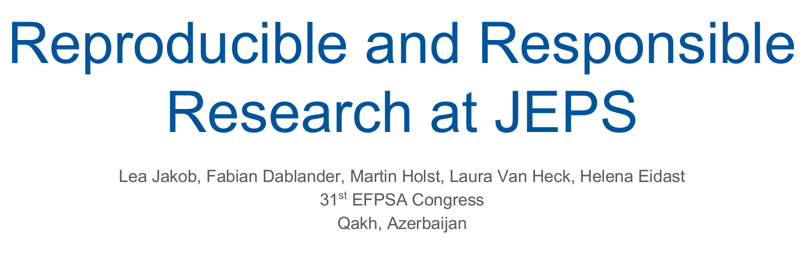

# An Introduction to JEPS

This workshop has been presented at the 31st EFPSA Congress in Qakh, Azerbaijan. It provides an introduction to the work of the Journal of European Psychology Students (JEPS). Applications to become part of the editorial team of JEPS open once a year. Thus, team members come and go; the summary presented here is a culmination of the work done by different enthusiastic psychology students who are passionate about research and improving psychological science. We want to thank all past members for their hard work and important contribution, and we are looking forward to working with the new team members.

> Over the last few years, psychology, the social and increasingly also biomedical sciences have been in a whirlwind of failures to replicate, verbal insults, scientific fraud, and misplaced, reactionary, "nothing is wrong, proceed as usual" attitudes from more senior researchers. In this workshop, we outline how we arrived at this state of affairs --- the reproducibility crisis --- and how to move forward. Concretely, we provide guidelines and practical tips on how to create an open, reproducible, and rigorous fundament for psychological science. Along those lines, we discuss our work at the Journal of European Psychology Students (JEPS) and how we help increase the transparency and reproducibility of psychological research.